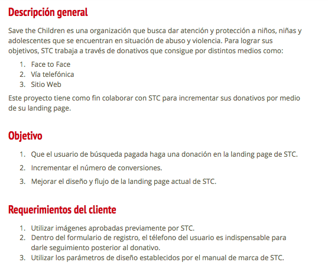
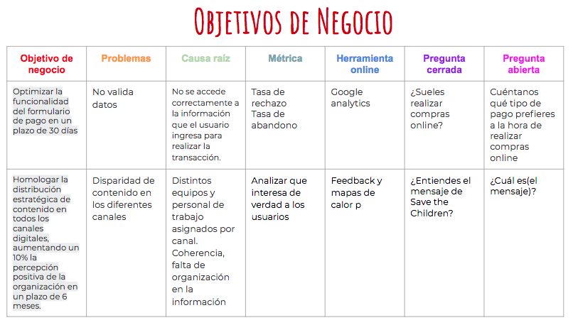
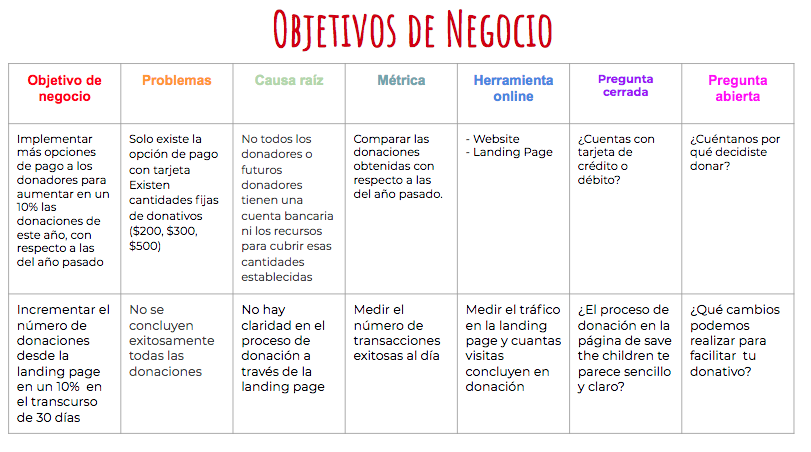
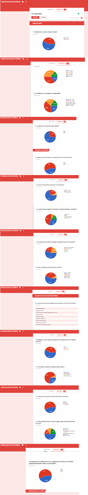
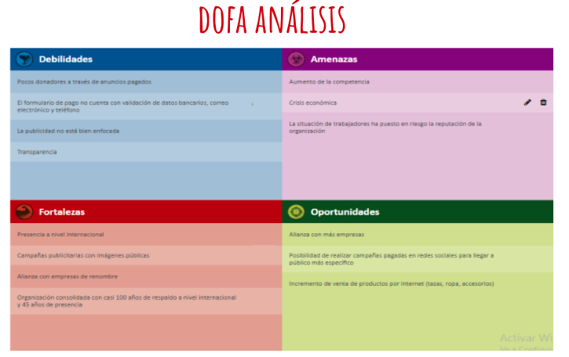
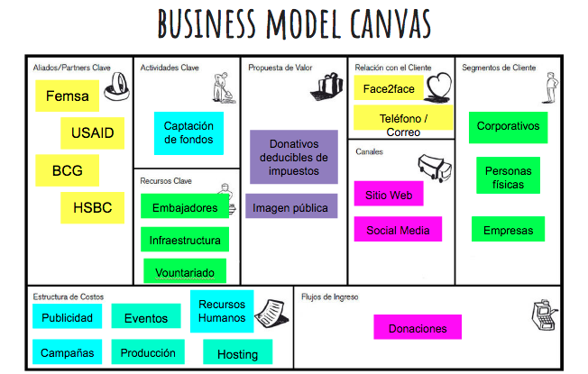
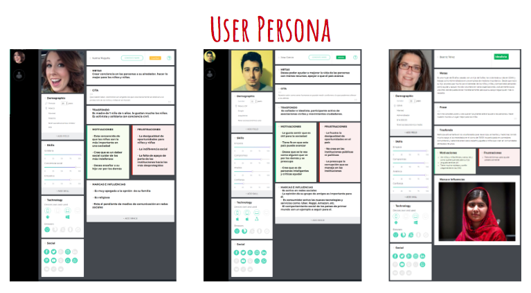
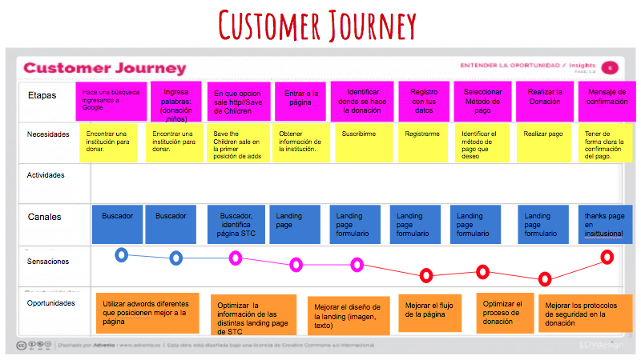

# Save the Children 

#Elaborado para Save the children - Laboratoria

 **Anális:**
Incrementar el número de donadores que llegan a la landing page de Save The Children México a través del anuncio de Google Adwords.

Equipo de trabajo:

1 Dueño de producto Product Owner

2 UX Design

3 UX Research

***Herramientas que se utilizaron en el proyecto**

Illustrator

Photoshop

Google Analytics

ux-research

ux-ui

Hubspot

Invision 

Instapage

Se utilizaron durante el proceso para análisis, prototipado e implementación.

***

# Definición del objetivo

# Reserch
OBJETIVO DE NEGOCIO

***

OBJETIVO DE USUARIO
# User Reserch

# CUSTOMER JOURNEY

# DESIGN

  
  
  

  

   
   
   

